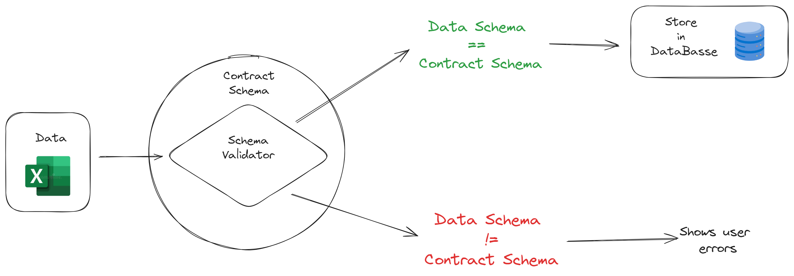

# Excel Schema Validator

This project consists of a web application that validates a specific Excel schema and stores the data in a PostgreSQL database. The predefined schema is the contract schema, and the application validates it from Excel files using Pydantic, a Python validation library.

Additionally, this project includes Continuous Integration (CI) for every Pull Request made using GitHub Actions. The schema contract is tested, along with functional and integration tests in each PR. All tests are performed using the pytest library.


## Context

The context of this project reflects a common scenario within organizations, where various departments routinely exchange data using Excel files that adhere to a predefined table schema. However, errors or inconsistencies, such as missing data or unexpected data formats, can disrupt workflows and cause delays in projects. 

By defining a clear data contract that outlines the expected structure, the application can identify any deviations from this contract.

The contract schema that this specific project aims to validate is as follows:

| Column   | Data Type                                 |
|----------|-------------------------------------------|
| email    | Email structure (text@text.com)           |
| date     | Date (yyyy-mm-dd)                         |
| value    | Numeric Positive                          |
| product  | Text                                      |
| amount   | Numeric Positive Integer                  |
| category | Only 3 options (*category1*, *category2* or *category3*) |

The app functionality can be tested with the 3 files inside the [data](https://github.com/lealre/excel-schema-validator/tree/master/data) folder.

## How it works

The user can upload Excel files in the app, and if the schema differs from the contract, the application will display a message indicating where the data schema differs from the contract schema, highlighting the specific rows and columns where the data does not conform to the agreed-upon schema.

If the schema from the uploaded file passes validation, the app gives the option to store the data in the database



### Project Folder Structure

```
├── Dockerfile
├── README.md
├── data
│   ├── aditional_column.xlsx
│   ├── correct.xlsx
│   └── wrong.xlsx
├── media
│   ├── app-diagram.png
│   └── demo.gif
├── pyproject.toml
├── requirements.txt
├── source
│   ├── app.py
│   ├── backend.py
│   ├── contract.py
│   └── frontend.py
├── sql
│   └── create.sql
└── tests
    ├── __init__.py
    ├── test_app.py
    ├── test_contract.py
    └── test_integration.py
```

## How to run this project

All the steps from here were intended to a `bash` terminal.

To properly run this project locally, you need to connect the app to your own PostgresSQL database. You can do this by following the steps below:

1.1 - Clone the repository locally:
```bash
git clone https://github.com/lealre/excel-schema-validator.git
```

1.2 - Access the project folder:
```bash
cd excel-schema-validator
```

1.3 - Create the `.env` file in the root folder, passing the respective keys from your own PostgresSQL Database:
```bash
echo "POSTGRES_USER=<your-database-keys>" >> .env
echo "POSTGRES_PASSWORD=<your-database-keys>" >> .env
echo "POSTGRES_HOST=<your-database-keys>" >> .env
echo "POSTGRES_PORT=<your-database-keys>" >> .env
echo "POSTGRES_DB=<your-database-keys>" >> .env
```

1.4 - Make sure `.env` file is included in `.gitignore`.

From here, we have two options to run the project:

- Configuring the local setup
- Using Docker

### Local Setup

To configure the local setup, we will use `pyenv` (version 2.3.35).

Once we have cloned the repository and accessed the root folder (steps 1.1 and 1.2), we follow the steps below:

2.1 - Install Python version 3.11.5:
```bash
pyenv install 3.11.5
```

2.2 - Set the local version of Python to 3.11.5:
```bash
pyenv local 3.11.5
```

2.3 - Create a virtual enviroment and activate it:
```bash
python -m venv .venv
source .venv/bin/activate
```

2.4 - Install all dependencies from the project:
```bash
pip install -r requirements.txt
```

2.5 - Run the project:
```bash
task run
```

2.6 -  (Optional) Run the tests:
```bash
task test
```

### Using Docker

Once we have cloned the repository and accessed the root folder (steps 1.1 and 1.2), we follow the steps below:

3.1 -  Build the image:
```bash
docker build -t excel-schema .
```

3.2-  Create the container:
```bash
docker run -d -p 8051:8051 --name excel-schema-container excel-schema
```

3.3 - Access link in your browser

[http://localhost:8051/](http://localhost:8051/)